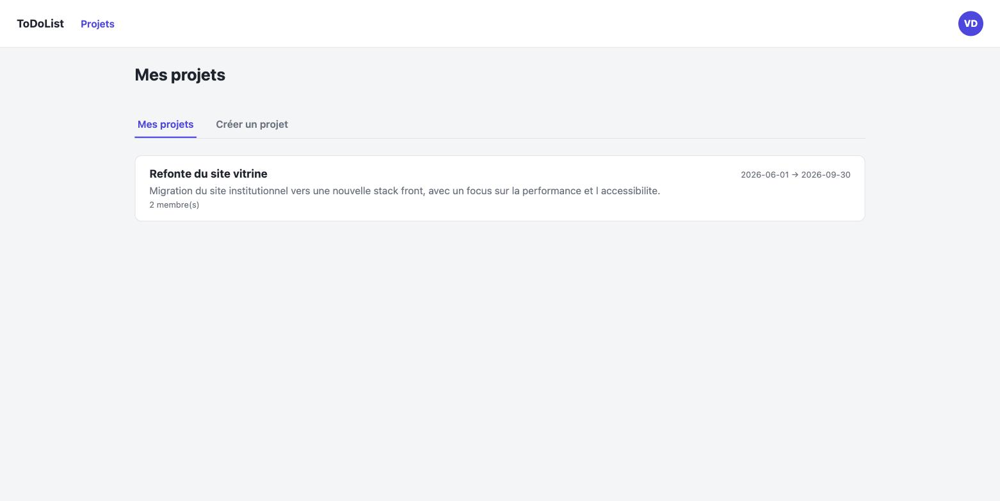
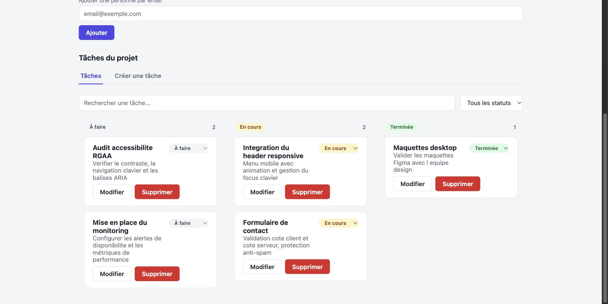
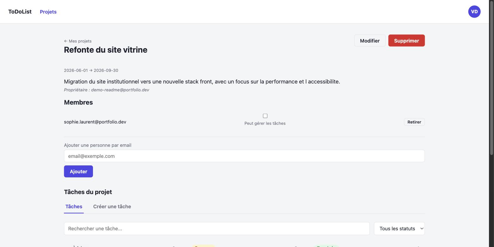
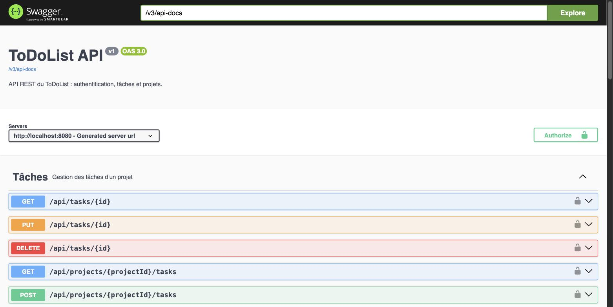

# ToDoList


Application de gestion de tâches et de projets en équipe, avec authentification JWT, verrouillage progressif du compte, tableau Kanban par glisser-déposer et un modèle de permissions par membre de projet. Développée comme pièce de portfolio pour couvrir, sur un périmètre volontairement complet, ce qu'on attend d'une API REST sécurisée et de son client Angular : contrôle d'accès correctement testé, conteneurisation, intégration continue, documentation d'API et tests de bout en bout.

## Sommaire

- [Aperçu](#aperçu)
- [Fonctionnalités](#fonctionnalités)
- [Stack technique](#stack-technique)
- [Démarrage avec Docker](#démarrage-avec-docker)
- [Développement local](#développement-local)
- [Tests](#tests)
- [Documentation de l'API](#documentation-de-lapi)
- [Sécurité](#sécurité)
- [Intégration continue](#intégration-continue)
- [Structure du dépôt](#structure-du-dépôt)

## Aperçu

| Projets | Tableau Kanban |
|---|---|
|  |  |

| Détail d'un projet et gestion des membres | Documentation de l'API |
|---|---|
|  |  |

## Fonctionnalités

**Comptes et authentification**
- Inscription et connexion par JWT, mots de passe hachés avec BCrypt
- Politique de mot de passe (longueur minimale, majuscule, chiffre, caractère spécial)
- Verrouillage progressif après échecs de connexion répétés (1 min, 5 min, 10 min, puis verrouillage permanent nécessitant une réinitialisation par un administrateur)
- Emails normalisés en minuscules pour éviter les doublons de compte
- Modification du profil (nom, prénom, email)

**Projets et tâches**
- Un projet a un propriétaire, des dates de début/fin et une liste de membres
- Les tâches appartiennent à un projet et se déplacent entre trois statuts (à faire, en cours, terminée) par glisser-déposer ou menu déroulant
- Recherche et filtrage des tâches par statut
- Détail d'une tâche en modale, avec édition et suppression

**Permissions**
- Le propriétaire d'un projet gère les membres et peut accorder à chacun le droit de gérer les tâches
- Un membre sans ce droit peut consulter le projet et déplacer les tâches, mais ne peut ni en créer, ni en modifier le contenu, ni en supprimer
- Un rôle ADMIN a accès en lecture à l'ensemble des projets et peut réinitialiser le mot de passe d'un compte verrouillé

## Stack technique

| Couche | Technologies |
|---|---|
| Backend | Spring Boot 4.1.0, Spring Security, Spring Data JPA, Flyway, JJWT |
| Frontend | Angular 21 (composants standalone, signals, zoneless), Angular CDK (drag-and-drop) |
| Base de données | PostgreSQL 16 |
| Tests backend | JUnit 5, Mockito, Testcontainers |
| Tests frontend | Vitest |
| Tests end-to-end | Playwright |
| Documentation API | springdoc-openapi / Swagger UI |
| Infrastructure | Docker, Docker Compose, GitHub Actions |

## Démarrage avec Docker

Le moyen le plus rapide de lancer l'application complète (backend, frontend, base de données).

```bash
cp .env.example .env
# renseigner JWT_SECRET dans .env, par exemple avec :
openssl rand -base64 64

docker compose up --build
```

- Frontend : http://localhost:4200
- API : http://localhost:8080/api
- Documentation Swagger : http://localhost:8080/swagger-ui/index.html

## Développement local

### Prérequis

- Java 21
- Node.js 22
- Docker (pour PostgreSQL, ou une instance PostgreSQL 16 locale)

### Base de données

```bash
docker run -d --name todolist-db \
  -e POSTGRES_DB=todolist -e POSTGRES_USER=todolist -e POSTGRES_PASSWORD=todolist \
  -p 5432:5432 postgres:16
```

### Backend

```bash
cd Backend
export JWT_SECRET=$(openssl rand -base64 64)
./mvnw spring-boot:run
```

L'application refuse de démarrer si `JWT_SECRET` n'est pas défini. Les migrations Flyway s'appliquent automatiquement au démarrage.

### Frontend

```bash
cd frontend
npm ci
npx ng serve
```

## Tests

```bash
# Backend : 68 tests (unitaires + intégration via Testcontainers)
cd Backend && ./mvnw test

# Frontend : 102 tests (Vitest)
cd frontend && npx ng test --watch=false

# End-to-end : 5 scénarios (Playwright, nécessite le backend et le frontend démarrés)
cd e2e && npm ci && npx playwright test
```

Les tests d'intégration backend démarrent leur propre conteneur PostgreSQL via Testcontainers ; aucune base de données locale n'est requise pour les lancer.

## Documentation de l'API

La documentation interactive est générée à partir du code (annotations OpenAPI) et accessible sur `/swagger-ui/index.html` une fois le backend démarré. Elle permet d'authentifier une requête avec un token JWT et d'exécuter directement les appels depuis le navigateur.

## Sécurité

Le projet a fait l'objet d'un audit orienté OWASP, avec exploitation réelle des failles trouvées avant correction (secret JWT compromis, absence de normalisation des emails, fuite de trace d'exécution sur une erreur non gérée). Le détail est consultable dans l'historique des commits et des pull requests. Points notables de l'implémentation actuelle :

- Le secret de signature JWT est obligatoirement fourni par variable d'environnement, jamais committé
- Contrôle d'accès vérifié à chaque niveau (projet, tâche, membre) plutôt que délégué au seul frontend
- Requêtes paramétrées via JPA/Hibernate, aucune concaténation de SQL
- Gestionnaire d'erreurs global évitant toute fuite de détail d'implémentation dans les réponses HTTP

## Intégration continue

Chaque push et chaque pull request déclenchent quatre jobs indépendants sur GitHub Actions : tests backend, tests frontend, build des images Docker, et suite end-to-end complète (base de données, backend et frontend démarrés dans le pipeline). Le détail est dans [`.github/workflows/ci.yml`](.github/workflows/ci.yml).

## Structure du dépôt

```
Backend/     API Spring Boot
frontend/    Application Angular
e2e/         Tests Playwright
docs/        Ressources pour la documentation (captures d'écran)
```
